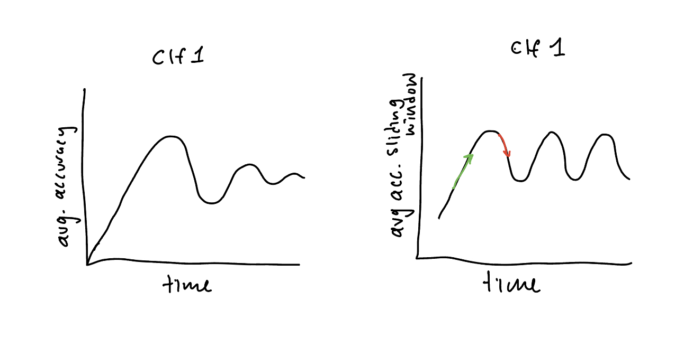

### Main Phases
1. Pretrained classifiers delgate on an ordered (non-i.i.d.) test set
   - each clf if trained on a few classes
   - The ensemble as a whole is used to predict on the ordered test set
2. Continual Learning
   - The classifiers that make up the ensemble are trained on an ordered (non-i.i.d.) training set
   - The ensemble as a whole is used to predict on an i.i.d. test set that contains all classes
3. Online Learning
   -  The whole ensemble is trained on and predicts an ordered stream of data
   -  This can be thought of as continual learning, but where we care about the performance on the training set and lack a test set

### General Flow
- Train/use at least k classifiers at a time (fixed number of experts/gurus)
- When the metric of interest of the ensemble begins to decrease, quit training/using that clf and start training/using an inactive classifier $c_l$
    - i.e. $c_l$ stops delegating and starts training / being used

### Possible Metrics
- Accuracy over all examples seen so far
- Accuracy over the last $n$ examples seen (sliding window)
- Rate of change of change between two windows of size $n$

### Continual vs. Online Learning
- In online learning we care about the performance on the training set. This means that we would likely not want to immediately stop training a classifier when it begins to perform poorly. Instead, we would want to start training another classifier and only stop training the first classifier when the second classifier begins to perform sufficiently well.
- In continual learning we don't care about the performance on the test set. This means that we would likely want to immediately stop training a classifier when it begins to perform poorly. This is because we don't want to waste time training a classifier on a new problem when there is potentially a more plastic (less trained) classifier that could pick up this new problem more easily/quickly.

### Framework Flow
- run_trial:
    - for each increment:
        - create train/test data
        - evaluate ensemble on increment
        - save metrics
        - train ensemble on increment (training after evaluation because if we had the labels to train on, there would be no sense in evaluating/predicting)
        - delegate

